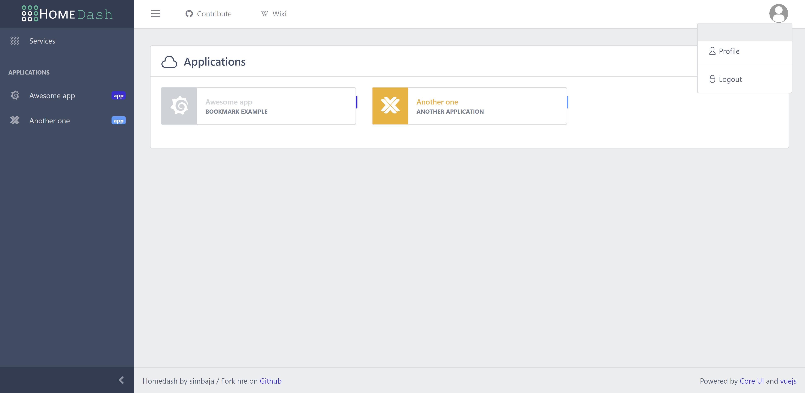

# Home Dashboard

## Description

A simple admin-page focused Home Dashboard to keep services organized using a configuration file.  Inspired by [Homer](https://github.com/bastienwirtz/homer).



### Demo

A fully functional demo is available at: (http://website)

### Table of Contents

- [Features](#features)
- [Usage](#usage)
- [Documentation](#documentation)
- [Contributing](#contributing)
- [License](#copyright-and-license)

### Features

- [yaml](http://yaml.org/) file configuration
- Keycloak authentication
- Responsive
- Embedded service links

### Usage

Homedash is a full static html/js dashboard, generated from the source in `/src` using webpack. It's meant to be served by an HTTP server, **it will not work if you open dist/index.html directly over file:// protocol**.

#### Using docker

```sh
docker run -p 8080:8080 -v /your/local/config.yml:/www/config.yml -v /your/local/assets/:/www/assets simbaja/homedash:latest
```

As a bind mount is used here, docker will not copy the initial content of the `assets` directory to the mounted directory. 
You can initialize your assets directory with the content provided in this repository

```sh
cp -r /public/assets/* /your/local/assets/
```

**Alternatively** if you just want to provide images/icons without customizing the other files, you can mount a custom directory in the `www` directory and use it in your `config.yml` for icons path.

#### Manually

Homedash is a static page that needs to be generated from the source in this repository.
Use the following command to build the project:

```sh
npm install
npm run build
```

Then your dashboard is ready to use in the `/dist` directory.

#### Development

```sh
npm install
npm run serve
```

### Documentation

For information about the `config.yml` file see the [configuration](docs/configuration.md) documentation.

## Copyright and license

Code released under [the MIT license](https://github.com/simbaja/homedash/blob/master/LICENSE).)
